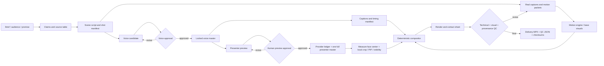

# Digital Human Video Production

> 从锁定语音、数字人预览、结构化动效到可审计成片的一体化 Codex Skill。

一个面向 Codex/本地创作工作流的通用 skill，用于把产品 brief、经过审核的旁白、数字人或真人口播、真实产品画面和动效合成为可交付的视频。

它不绑定某个品牌、脚本、页面或视觉系统。每个项目的产品事实、文案、色彩、字体、媒体和供应商参数都放在项目目录中；仓库只保留可复用的方法、规则、脚手架和质量门。

## Demo

这是一个项目级示例，不是 skill 的规范内容。它演示了：

- 本地语音克隆与短语级变速，保留呼吸和非匀速气口；
- 一次数字人母带生成，再在本地做显隐、裁切和画中画；
- 真实产品页面与结构化信息卡的动效编排；
- 画中画从开场主画面过渡到角落小窗；
- 字幕、音频、画面和最终交付 QC。

[观看/下载 v0.2 Demo 视频（1080p）](https://github.com/jaxxchen003/digital-human-video-production/releases/download/v0.2.0/digital-human-video-production-demo-v0.2.mp4)

公开 Demo 直接介绍这套通用制作链路：16:9、1920×1080、30fps、约 121 秒、H.264/AAC。内容、页面和视觉仅用于展示方法，不是可复制到其他项目的品牌模板。

## v0.2：来自完整生产的新增能力

- **一次完整母带预算**：短预览通过人工审核后，同一音频 checksum 默认只允许一条已提交或完成的 presenter master；镜头级修改全部留在本地。
- **可审计 provider ledger**：记录 preview/full-master、审批引用、媒体时长与 SHA-256，重复完整生成必须写明异常原因。
- **测量式 PIP 裁切**：从多个时刻的人物中心计算 source crop、左右角坐标和输出误差，不再假设 `object-fit: cover` 会自动居中。
- **双视图无黑边过渡**：全画幅和 measured crop 使用同一母带、同一时间轴、静音同步交叉淡化，避免全屏缩到圆形时露黑边或人物跳位。
- **增强交付 QC**：完整解码、音画时长差、EBU R128 响度、黑帧、presenter master 停帧、设计性阅读 hold 分类、contact sheet 和三份主媒体 checksum 一次输出。

## 能力介绍

| 能力 | 产物 | 关键约束 |
| --- | --- | --- |
| Brief 与事实管理 | 项目 manifest、来源表、分场脚本 | 每个重要断言都有来源和审核人 |
| 语音克隆 | 候选音频、锁定母带、生成 manifest | 锁定母带后才建立视觉时钟 |
| 数字人口播 | 预览、完整 presenter master、审核事件 | 先短预览，再生成一次完整母带 |
| Provider 成本与状态 | 私有 JSONL ledger | 同一锁定音频默认只有一个已提交或完成的完整母带任务 |
| 动效分镜 | shot manifest、scene packet、caption timing | 每个镜头一个主动作，之后留出阅读保持 |
| 本地合成 | measured crop、PIP schedule、字幕、最终 MP4 | 数字人静音复用，不遮挡页面、URL、代码或字幕 |
| MCP/连接器演示 | 脱敏的请求与结果画面 | 不展示 token、cookie、私有 slug 或原始 header |
| QC 与交付 | contact sheet、QC JSON、checksum | 异常停帧与声明的阅读 hold 分开判断 |

## 依赖与技术方案

本 skill 明确记录一条可复现的参考技术栈，同时保留清晰的适配器边界。下面列出的是制作工具和运行依赖，不是视频里要介绍的品牌或产品；视频主题、产品事实、文案、颜色、字体和页面始终由每个项目的本地 manifest 提供。

### 参考实现栈

| 层 | 推荐方案 | 负责什么 | 必选性 | 可替换边界 |
| --- | --- | --- | --- | --- |
| 语音 | [**VoxCPM / VoxCPM2**](https://github.com/OpenBMB/VoxCPM)（本地语音克隆） | 生成锁定的 WAV、短语级节奏和 generation manifest | 参考路径必选 | 任意能输出 WAV + 时间/生成记录的本地或云端 TTS/克隆引擎 |
| 数字人 | [**HeyGen Photo Avatar / Avatar API**](https://developers.heygen.com/reference/create-video) | 用锁定音频生成 12–15 秒预览，再生成一条完整 presenter master | 使用数字人时必选 | 本地 talking-head、真人录制或其他 Avatar API；仍需保留预览门和一次完整母带 |
| 动效 | [**HyperFrames**](https://github.com/heygen-com/hyperframes) + [GSAP runtime](https://hyperframes.app/docs/3-guides/3-gsap-animation) | 组织 scene packet、信息层级、可 seek 镜头动作和动效检查 | 参考路径必选 | CSS/WAAPI runtime、等价 React/HTML、动效工具或 NLE；必须输出可校验的镜头时间线 |
| 合成 | [**Remotion**](https://www.remotion.dev/docs/render) | 按确定性时间线合成 measured PIP、字幕和音频 | 参考路径必选 | FFmpeg filter graph、NLE 或其他可复现合成器 |
| 媒体与 QC | [**FFmpeg/ffprobe**](https://ffmpeg.org/documentation.html) + Python | 编码、完整解码、响度、黑帧、冻结帧、contact sheet、checksum 和 QC JSON | 本仓库完整 QC 必选 | 等价媒体工具，但必须保留机器检查和人工观看证据 |
| 字幕/对齐 | Whisper 或其他 ASR | 词级时间戳、字幕和旁白一致性检查 | 可选 | 任意能生成可审计时间戳的 ASR |

参考路径可以概括为：

```text
VoxCPM 锁定 WAV
  → HeyGen 预览与完整 presenter master
  → HyperFrames + GSAP scene packet / base motion
  → Remotion PIP、字幕与确定性合成
  → FFmpeg/ffprobe 编码与 QC
```

这张表描述“哪个工具解决哪类工程问题”，不规定内容中应该出现哪个品牌。供应商账号、HeyGen avatar/profile ID、VoxCPM 模型权重与参考音频、项目页面、客户素材和 API 凭据都必须留在项目私有目录或 secret store 中，不能写进公开 skill。

### 运行依赖与私有边界

- Python 3：运行仓库自带的标准库脚本；
- `ffmpeg` / `ffprobe`：媒体元数据、完整解码、响度、黑帧/静帧、contact sheet 和交付检查；
- Node.js/npm：运行 Remotion 或其他 React/TypeScript 合成器；
- HyperFrames 的 CLI/checker，以及其采用的动画 runtime（参考路径默认是 GSAP）；
- HeyGen 的账号/API 或已授权的应用工作流，仅由项目私有 adapter 调用；
- VoxCPM/VoxCPM2 的本地运行环境、模型权重和参考音频，仅由项目私有 runbook 管理；
- 浏览器录制、设计导出或素材库，用于提供真实产品页面与合法素材；
- 可选的 Git LFS、对象存储或 GitHub Release，用于存放不适合进入普通 Git 历史的大型 Demo 媒体；
- 可选的 MCP/连接器客户端，用于演示工具调用或发布结果。

公开仓库只提供接口、脚本、规则和校验方法，不包含供应商 SDK、上传逻辑、账号授权、模型权重或产品内容。云端语音、脸部或客户素材的上传必须由项目自己的私有适配器完成。

更完整的输入/输出接口、官方文档、许可证边界和参考项目见 [`references/dependencies.md`](references/dependencies.md)。Remotion、模型权重、字体、音乐和参考仓库分别遵循各自许可证，不因本仓库采用 Apache-2.0 而自动改变。

## 安装与使用

```bash
git clone https://github.com/jaxxchen003/digital-human-video-production.git
cd digital-human-video-production

# 校验 skill 结构（需要 Codex skill-creator 的 quick_validate.py）
python3 /path/to/quick_validate.py .

# 创建一个不包含媒体的项目骨架
python3 scripts/init_project.py \
  --path ./my-video \
  --title "Product explainer"

# 根据场景边界生成 presenter 布局时间表
python3 scripts/build_avatar_schedule.py \
  --duration 120 \
  --scene-ends "24,48,72,96" \
  --left-scenes "3" \
  --output ./my-video/config/avatar-schedule.json

# 用多个时刻的人物中心生成稳定的 source crop 与 PIP 几何
python3 scripts/build_pip_geometry.py \
  --measurements ./my-video/config/pip-face-centers.json \
  --pip-diameter 220 \
  --output ./my-video/config/pip-geometry.json

# 在私有 ledger 记录预览/完整母带；不会调用或上传到 provider
python3 scripts/record_provider_job.py \
  --log ./my-video/logs/provider-generation.jsonl \
  --provider avatar-provider \
  --stage preview \
  --status completed \
  --audio ./my-video/audio/narration-master.wav \
  --output ./my-video/presenter/preview.mp4

# 对最终媒体运行完整交付检查
python3 scripts/validate_delivery.py \
  --video ./my-video/deliverables/final.mp4 \
  --voice-master ./my-video/audio/narration-master.wav \
  --presenter-master ./my-video/presenter/master.mp4 \
  --approved-holds ./my-video/config/approved-holds.json \
  --contact-sheet ./my-video/deliverables/contact-sheet.jpg \
  --output ./my-video/deliverables/qc.json
```

在 Codex 中，skill 的调用形式是：

```text
Use $digital-human-video-production to produce a verified presenter-led product video.
```

供应商命令、模型参数、账号、素材路径和产品事实应由项目自己的私有 runbook 提供。

## 工作流链路



核心原则是：锁定语音后再排时间线；数字人只生成一次完整母带；人物视频全程静音复用；所有镜头级布局、裁切和动效在本地完成。

## 规则

### 内容与事实

1. 每个 load-bearing claim 都要有来源、检索时间和审核责任人。
2. 真实产品画面优先；示意画面必须明确标注为 mock 或 illustration。
3. 产品能力、权限、格式边界、访问条件和返回 URL 不凭截图推断。
4. 项目变量放在本地 manifest；公共 skill 不携带品牌、客户内容或具体脚本。

### 语音与数字人

1. 旁白母带是唯一时间基准，任何音频变更都会重新打开时间线审核。
2. 变速只作用于短语区域；呼吸、停顿和气口保持原速或单独设计。
3. 先生成 12–15 秒预览，再生成一条完整数字人母带。
4. 检查前后音色一致、唇形同步、眼神、微表情、手势和冻结帧。
5. provider ledger 以锁定音频 checksum 为键，在第二次付费提交前阻止重复完整母带任务。
6. 供应商任务记录、头像/资产 ID、API key 和原始响应只留在私有环境。

### 镜头与动效

1. 每个 shot 只有一个主要动作：落位、路径绘制、分裂比较、输入、解析或交付。
2. 动作结束后必须有阅读保持，不用连续漂移填充时间。
3. Presenter 是讲解层，不得覆盖页面核心、URL、代码、表格或字幕。
4. 画中画尺寸、圆角、位置、caption keep-out 和显隐规则全部配置化。
5. 从多个时刻测量人物中心后再计算 crop；不要把 `object-fit: cover` 当作居中证据。
6. provider 人物视频保持静音，锁定 WAV 是最终音频和时间轴的唯一来源。
7. 优先真实页面、清晰层级和克制转场；避免重阴影、无意义光效和模板式级联。

### 隐私与版权

1. 不把音频、视频、客户页面、私有截图、token、cookie 或 `.env` 提交到 skill。
2. 字体、Logo、音乐、SFX、模型和页面素材分别记录授权与归属。
3. 大型 Demo 媒体优先使用 Git LFS、Release 或对象存储；本项目 Demo 作为 Release 资产提供，不属于 skill 核心。

## 质量把控

### 自动化检查

```bash
python3 /path/to/quick_validate.py .
python3 -m py_compile scripts/*.py tests/*.py
python3 -m unittest discover -s tests -v
python3 scripts/validate_delivery.py \
  --video deliverables/final.mp4 \
  --voice-master audio/narration-master.wav \
  --presenter-master presenter/master.mp4 \
  --approved-holds config/approved-holds.json \
  --contact-sheet deliverables/contact-sheet.jpg \
  --output deliverables/qc.json
```

项目合成器还应运行 lint、typecheck、bundle/render smoke test 和 motion checker。默认媒体检查包括：

- 视频编码、分辨率、帧率、旋转信息和时长上限；
- 音频编码、采样率、声道、响度和 true peak；
- 完整解码、黑帧事件、缺失流、异常静帧和文件完整性；
- presenter master 停帧必须为零；最终画面停帧只在匹配声明的 readable hold 时允许；
- 锁定语音、presenter master 与最终视频的时长差不超过项目 tolerance；
- 最终视频、旁白母带、数字人母带的 SHA-256；
- manifest、工具版本、审批事件和来源记录是否齐全。

### 人工复核

至少观看开头、数字人从主画面进入 PIP 的位置、每个主要页面、信息密集段、连接器结果和结尾。确认：

- 字幕与语音同步，英文 URL/命令没有被错误断行；
- 数字人的口型、眼神、表情和呼吸感自然，没有明显冻结；
- PIP 不遮挡核心内容，动效完成后有足够阅读时间；
- 页面、字体、颜色、素材授权和产品事实符合项目 manifest；
- 输出在目标播放器和实际交付尺寸下仍然可读。

任何未完成的检查都必须把交付标记为 `preview` 或 `candidate`，不能标记为 `final`。

## 动效形式

动效可以从以下形式中选择，并根据项目视觉系统重绘：

- **卡片落位**：多个输入逐一进入固定位置，最后形成结构化关系；
- **路径绘制**：从文件/输入到处理层再到用户可见结果，逐站推进；
- **分屏比较**：保持共同坐标系，按同一标准逐项比较选项；
- **输入—确认—结果**：真实字段输入、一次按钮动作、状态确认和结果解析；
- **锚点循环**：核心页面保持稳定，周围的受众、场景或状态替换；
- **Presenter PIP**：主画面到小窗的短暂 settle、换角、隐藏与再次出现；
- **收束交付**：清掉非关键 chrome，只留下 URL、结果或下一步 CTA。

### 动效与流程参考

- [video-shotcraft](https://github.com/Vincentwei1021/video-shotcraft)：shot card、单一动作、readable hold 和 Remotion 画面语法；
- [HyperFrames Motion Director](https://github.com/geekjourneyx/hyperframes-motion-director)：中文优先的 brief、storyboard、design-engineering contract 与审核门；
- [HyperFrames Motion Library](https://github.com/nutllwhy/hyperframes-motion-library)：参数化模板、透明叠加格式与本地模板库思路；
- [Rachel Digital Human Production](https://github.com/Jingyi-Wu-Richael/rachel-digital-human-production)：付费调用前置检查、15 秒预览和任务状态记录。

这些仓库都是方法参考，不是本 Skill 的运行依赖。不要复制素材、固定模板或品牌设计；其中 Motion Director 使用 AGPL-3.0，Motion Library 在本次核对时未声明仓库许可证，复用代码前必须单独确认。Rachel 的 MiniMax 路径也不是本 Skill 的依赖。

## 仓库结构

```text
.
├── SKILL.md
├── agents/openai.yaml
├── references/
│   ├── production-contract.md
│   ├── dependencies.md
│   ├── voice-pipeline.md
│   ├── avatar-pipeline.md
│   ├── provider-job-ledger.md
│   ├── presenter-compositing.md
│   ├── motion-pipeline.md
│   ├── qc-checklist.md
│   └── mcp-connector-handoff.md
├── scripts/
│   ├── init_project.py
│   ├── build_avatar_schedule.py
│   ├── build_pip_geometry.py
│   ├── record_provider_job.py
│   └── validate_delivery.py
├── tests/
│   └── test_scripts.py
├── LICENSE
└── README.md
```

## 未来拓展

- 多画幅 profile：16:9、9:16、4:5、1:1 的安全区与 measured PIP 几何自动重映射；
- Provider adapter：统一本地模型、Avatar API、真人录制和不同合成器的接口；
- Schema-first timeline：用 JSON Schema 校验 manifest、approval event、shot packet 和 QC report；
- 语音质量增强：自动检测前后音色漂移、异常停顿、ASR 相似度和多语言字幕；
- 视觉回归：自动人物检测、关键帧差异、遮挡检测、字幕 safe-area 和页面可读性评分；
- 审批与发布：把 brief、音频、数字人预览、时间线、QC 和 release asset 串成可审计事件流；
- 连接器适配：为不同 MCP/workspace host 提供脱敏的请求、权限和结果展示模板；
- 成本与缓存：在现有 provider ledger 上增加真实金额、额度和可复用资产命中率。

## License

Apache License 2.0。项目媒体、字体、模型、Logo、页面截图和第三方素材不因本仓库许可证自动获得再分发权。
